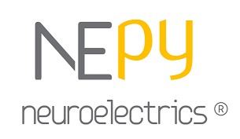

# NEPy


## Introduction to NEPy
This is the repository for *NEPy*, a toolbox to work with [Neuroelectrics](https://www.neuroelectrics.com/ "NE homepage") 
EEG ``.easy`` and ``.easy.gz``(with or without ``.info`` files), or compressed ``.nedf`` files. See the 
[Neuroelectrics wiki](https://www.neuroelectrics.com/wiki/index.php?title=Neuroelectric%27s_Wiki "NE wiki") for more 
information on these file formats.  

The basic class of this repository is ``Frida``, a module to read the data files and provide methods to check the 
quality and perform a basic pre-processing pipeline. NEPy also provides another module called ``batch`` witch uses 
`Frida`'s methods to process *all* the data files in a folder.
*For a detailed information about the modules, please check the 
Jupyter Notebook Demos (in *demos* folder), where you 
can find a description of the module, its main attributes, methods and useful examples of use.*


## Getting started
#### Prerequisites
- NEPy *should* work on the following operating systems: Windows, Mac OS and Linux.  
- It works with Python 3.x
- Size: around 17,0 MB

#### Installation

**Option 1**:
1. Clone or download the NEPy repository in your computer.  
2. Add the path where the cloned/saved repository is to the Python environment.
3. Import nepy  

Check the Jupyter Notebook Demos
(or .html version) for an example on how to proper use this module!

**Option 2**:  
You can install nepy as a usual python package using `pip install nepy`.
Then, in the code, you don't need to append the path to the system you can already import it.   

Example:
```
# Option1
nepypath = 'C:\Users\roser.sanchez\Documents\Git\NEPy'
import sys
sys.path.append(nepypath)

# Option1 and Option2
import nepy as ne
from nepy.frida.frida import Frida
from nepy.frida.batch import processDirectory
```

## Requirements
Make sure you have at lest the following versions of the dependencies of NEPy. 
```
matplotlib>=2.2.2
numpy>=1.14.5
pandas>=0.23.1
scipy>=1.2.0
```

## Contributing
1. Fork it
2. Create your feature branch 
3. Commit your changes 
4. Push to the branch
5. Create a new Merge Request

## Contact
Any doubt?   
Please contact: support@neuroelectrics.com

## Authors
Main: Giulio Ruffini and Roser Sanchez  
Contributors: Sergi Aregall and Javier Acedo.


