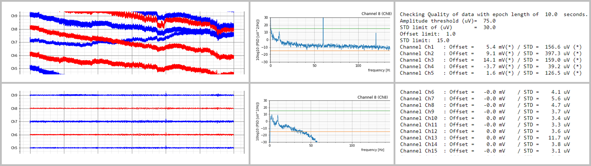

# NEpy


## Introduction to NEpy
This is the repository for *NEpy*, a toolbox to work with [Neuroelectrics](https://www.neuroelectrics.com/ "NE homepage") 
EEG ``.easy`` and ``.easy.gz``(with or without ``.info`` files), or compressed ``.nedf`` files. See the 
[Neuroelectrics wiki](https://www.neuroelectrics.com/wiki/index.php?title=Neuroelectric%27s_Wiki "NE wiki") for more 
information on these file formats.  

The basic class of this repository is ``Frida``, a module to read the data files and provide methods to check the 
quality and perform a basic pre-processing pipeline. NEpy also provides another module called ``batch`` witch uses 
`Frida`'s methods to process *all* the data files in a folder.
*For a detailed information about the modules, please check the 
[Jupyter Notebook Demos](http://git.starlab.es/Sanchez/nepy_support/tree/master/demos " NE jupyter demos"), where you 
can find a description of the module, its main attributes, methods and useful examples of use.*


## Getting started
#### Prerequisites
- NEpy *should* work on the following operating systems: Windows, Mac OS and Linux.  
- It works with Python 3.x
- Size: around 95,0 MB
#### Installation
1. Clone or download the NEpy repository in your computer.  
2. Add the path where the cloned/saved repository is to the Python environment.
3. Import nepy

Example:
```
nepypath = 'C:\Users\roser.sanchez\Documents\Git\NEpy'

import sys
sys.path.append(nepypath)

import nepy as ne
from nepy.frida.frida import Frida
from nepy.frida.batch import processDirectory
```

Check the [Jupyter Notebook Demos](http://git.starlab.es/Sanchez/nepy_support/tree/master/demos " NE jupyter demos") 
(or .html version) for an example on how to proper use this module! 

## Contributing
1. Fork it (http://git.starlab.es/nepy/nepy/forks/new)
2. Create your feature branch (`git checkout -b feature/newfeature`)
3. Commit your changes (`git commit -am 'Add some newfeature'`)
4. Push to the branch (`git push origin feature/newfeature`)
5. Create a new Merge Request (https://docs.gitlab.com/ee/user/project/merge_requests/)

## Authors
Main: Giulio Ruffini and Roser Sanchez  
Contributors: Sergi Aregall and Javier Acedo.

#### Neuroelectrics, November 2018

